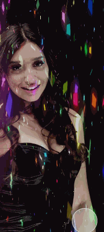
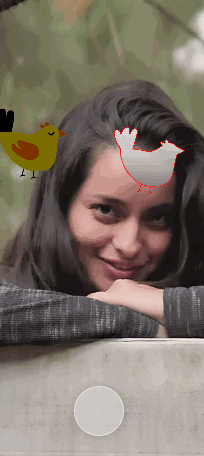
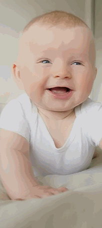

## Описание

Это готовые проекты которые делались в рамках самостоятельного обучения и тренировок.

Примеры брались из свободного доступа.

Цели обучения достигнуты, что нужно было продвинуть продвинуто.

## NeonLoveProjector
Эффект проектора - вся особенность в эффекте наложения на объект. Ретуши нет.

    

## CatchTheBird
Задача - близко соотнести контуры. Нажатие ставит движение на паузу.

    

## WeekdayMood
Отрисовывает текущий день недели выбранным шрифтом.
Можно таскать, зумировать.

    

## Субъекты РФ
Перебор в цикле картинок. По улыбке дается подсказка. Новые территории не включены.

    

## BlinkEmoji
Эффекты привязаны к морганию и открытию рта.

    

## Статистика Facebook
Ниже привожу статистику, чтобы было понятно насколько маски эффективны. 

  
Вовлеченность

  

  
Аудитория

  

## Послесловие 
Можно свободно использовать, редактировать и добавлять к себе в Instagram в качестве эффектов или масок.

Женщин и ребенка взял с www.pexels.com.

Inst: @mikedigriz